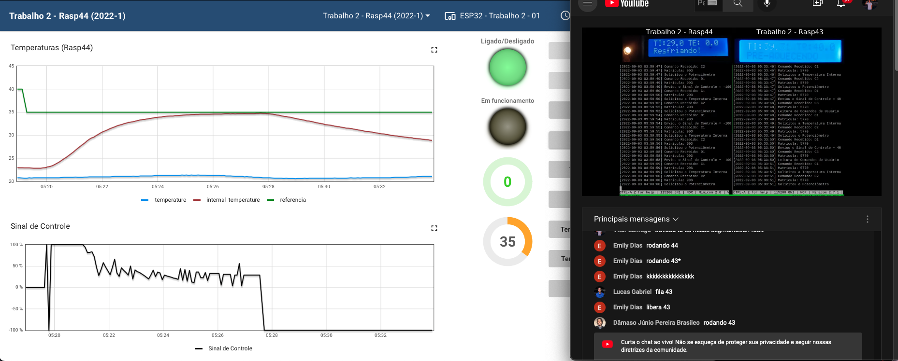

## O programa

Programa referente ao Trabalho 2 da disciplina de Sistemas Embarcos, referente ao desenvolvimento de um programa para controle de aparelhos "Air Fryer".

## Como executar

Após clonar o repositório, acesse a pasta do projeto, e no local onde tem o arquivo "Makefile" rode os seguintes comandos:

```
cd AirFryer_Embarcados
make
bin/run
```

A informação dos comandos pelo terminal está setando o tempo definido pelo usuário, a temperatura está sendo definida pelo dashboard, por não ser possível enviar o sinal de referência. O início do aquecimento é automático.

Para o controle pelo dashboard é necessário ligar o forno, aguardar alguns instantes, e então controlar a temperatura e o tempo que desejar, para aqeucer basta clicar em "Iniciar".

Para a utilização do menu, selecione o controle pelo dashboard, opção 2, e então navegue pelo menu apertando o botão "Menu". Para iniciar o aquecimento, basta clicar em "Iniciar".

## Testes Exemplificados

```
Teste 1: Realização de aquecimento a partir do controle pelo dashboard
Temperatura: 35
Tempo: 2 minutos
```

<p align="center">
  
</p>

```
Teste 2: Realização de aquecimento a partir do controle pelo terminal
Temperatura: 40
Tempo: 3 minutos
```

<p align="center">
  
  
</p>

```
Teste 3: Realização de aquecimento a partir de menu pré definido
Comida: Batata
Tempo: 2 minutos
Temperatura: 50

* Não deu pra pegar uma grande parte do resfriamento no print, só o início, por que tinha muita gente na fila
```

<p align="center">
  
</p>

## Observação

IMPORTANTE: O programa só funciona até o resfriamento na placa Raspberry 43, ao solicitar a temperatura do ambiente a placa 43 tem dado Segmentation Fault no programa. Na placa Rasp 44 o programa está rodando sem problemas.

O programa apresentou determinado bug no momento de enviar o estado do sistema como LIGADO, por conta disso é necessário que apareça no display "SISTEMA LIGADO" antes que qualquer outro comando seja lido pela comunicação UART.


